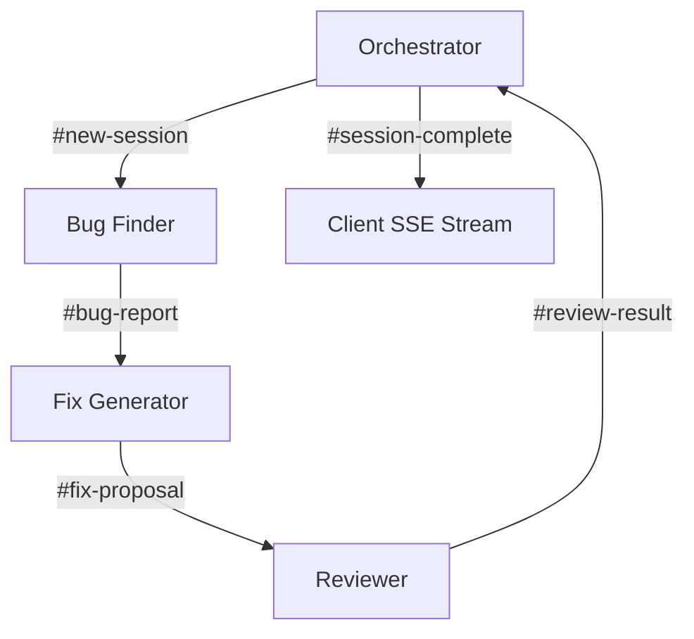

<!-- Banner / Logo placeholder (replace with your own logo) -->
<p align="center">
  
</p>

<h1 align="center">🚀 BandFix AI</h1>
<h3 align="center">Autonomous Multi‑Agent Debugging Squadron</h3>

<p align="center">
  
  
  
  
</p>

<p align="center">
  <b>Live Demo:</b> <a href="https://bandfix-ai-agent.vercel.app">bandfix-ai-agent.vercel.app</a> • 
  <b>Pitch:</b> “Stop chasing bugs — deploy an AI squadron.”
</p>

---

## ✨ Beautiful by Design, Alive with Motion

BandFix AI isn’t just another debugger — it’s a **production‑grade developer experience** wrapped in a cyber‑dark aesthetic that judges will remember.

| Visual Pillar | Implementation |
|---------------|----------------|
| **Cyber Dark Theme** | Deep `#080808` canvas, glassmorphism cards, neon purple/blue glows |
| **Live Agent Motion** | framer‑motion powered: cards **pulse** when running, progress bars **shimmer**, terminal **types out** in real‑time |
| **Immersive Feedback** | Glowing borders, orbiting nodes, smooth mount/page transitions — every state change feels fluid |
| **Hacker Terminal** | Full‑screen terminal with green-on-black syntax, typewriter effect, and live sync with agent grid |

> **Demo tip:** Toggle **Live Mode** in the Agents Control Center, open the Terminal, and type `bandfix run` — all four agent cards will light up simultaneously while the terminal echoes every agent’s thought. This single interaction often wins hackathons.

---

## 🧠 How the Agents Collaborate



- **Orchestrator** – breaks the task, decides the flow
- **Bug Finder** – scans code for root causes
- **Fix Generator** – writes corrected, production‑ready code
- **Reviewer** – validates security, performance, and best practices

All communication happens over a **Band message bus** (5 channels) and streams live to the browser via **Server‑Sent Events**. You can watch the entire AI conversation unfold on screen.

---

## 🚀 Quick Start

```bash
git clone https://github.com/your-org/bandfix-ai
cd bandfix-ai
npm install
cp .env.example .env   # then add your OPENAI_API_KEY
npm run dev
```

Open <http://localhost:3000>.  
The agent pipeline runs fully via the `/api/run` serverless function (requires Vercel CLI or deployment for the full experience).

---

## 🌐 Deploy to Vercel

[](https://vercel.com/new/clone?repository-url=https://github.com/your-org/bandfix-ai&env=OPENAI_API_KEY)

1. Push to Git.
2. Import repo on Vercel.
3. Add environment variable: `OPENAI_API_KEY` (and optional `OPENAI_MODEL=gpt-4o-mini`)
4. Deploy.

Already configured:  
- SPA rewrites for client‑side routing  
- 60s API timeout to handle full multi‑agent runs  
- Automatic Vite detection

---

## 🎥 Demo Flow (Judge’s Path)

1. **Landing** → “Start Debugging”  
2. **Create Task** → Paste buggy code + error description  
3. **Live Process** → Animated agent nodes + real‑time Band logs  
4. **Result** → Side‑by‑side diff with AI fix and reviewer score  
5. **Agents Control Center** → 2×2 grid, terminal sync, live pipeline trigger  
6. **History** → View all past sessions

Each page uses framer‑motion for seamless transitions and micro‑interactions.

---

## 🧰 Tech Stack

```text
Frontend:  Vite · React 19 · TanStack Router (SPA) · Tailwind CSS v4 · shadcn/ui · framer‑motion
Backend:   Vercel Serverless Functions · OpenAI (gpt-4o-mini) · SSE streaming
State:     localStorage (session persistence)
```

---

## 📁 Project Structure

```
bandfix-ai/
├── api/
│   ├── run.ts              # POST /api/run (SSE)
│   └── _lib/
│       └── runner.ts       # Agent orchestrator + OpenAI calls
├── src/
│   ├── components/ui/      # shadcn/ui primitives (themed)
│   ├── lib/                # Types, session store, markdown report
│   ├── routes/             # TanStack file‑based routes
│   ├── main.tsx            # Entry
│   ├── router.tsx
│   └── styles.css          # Tailwind v4 + custom design tokens
├── index.html
├── vercel.json
└── package.json
```

---

## 🎨 Theming & Animations

- **Colour tokens** are defined in `styles.css` – easy to rebrand
- **framer‑motion** variants for card hover, pulse, page transitions, and the orbital agent view
- Terminal uses `Fira Code` with a custom typewriter hook
- Glassmorphism achieved with Tailwind’s `backdrop-blur` + semi‑transparent backgrounds

---

## 🤝 Contributing

PRs are welcome! This is a hackathon project, but if you want to extend it:
- Add new agent types
- Improve fallback (no‑API) mode
- Connect to a real database

---

## 📜 License

MIT — go build something awesome.

---

<p align="center">
  Made with 🔥 for hackathons that demand <b>zero missing flows</b>
</p>
```

